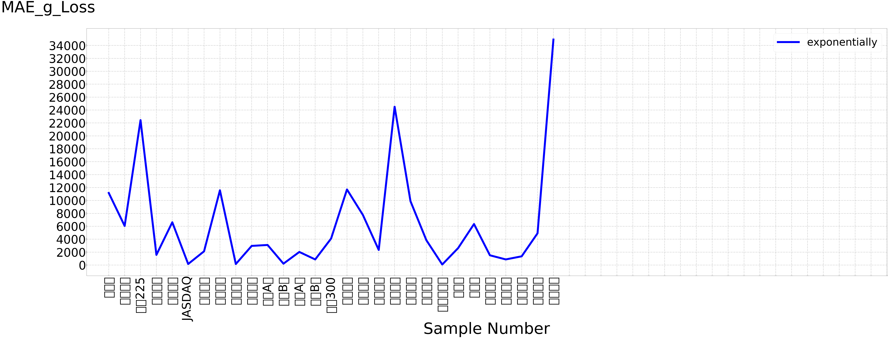

```python
import pandas as pd
url="http://stockq.org/market/asia.php"
data = pd.read_html(url)
data[7:][0]
```


<div>
<style scoped>
    .dataframe tbody tr th:only-of-type {
        vertical-align: middle;
    }

    .dataframe tbody tr th {
        vertical-align: top;
    }

    .dataframe thead th {
        text-align: right;
    }
</style>
<table border="1" class="dataframe">
  <thead>
    <tr style="text-align: right;">
      <th></th>
      <th>0</th>
      <th>1</th>
      <th>2</th>
      <th>3</th>
      <th>4</th>
      <th>5</th>
      <th>6</th>
      <th>7</th>
      <th>8</th>
    </tr>
  </thead>
  <tbody>
    <tr>
      <th>0</th>
      <td>亞洲股市行情 (Asian Markets)</td>
      <td>亞洲股市行情 (Asian Markets)</td>
      <td>亞洲股市行情 (Asian Markets)</td>
      <td>亞洲股市行情 (Asian Markets)</td>
      <td>亞洲股市行情 (Asian Markets)</td>
      <td>亞洲股市行情 (Asian Markets)</td>
      <td>亞洲股市行情 (Asian Markets)</td>
      <td>亞洲股市行情 (Asian Markets)</td>
      <td>亞洲股市行情 (Asian Markets)</td>
    </tr>
    <tr>
      <th>1</th>
      <td>股市</td>
      <td>指數</td>
      <td>漲跌</td>
      <td>比例</td>
      <td>最高</td>
      <td>最低</td>
      <td>開盤</td>
      <td>今年表現</td>
      <td>當地時間</td>
    </tr>
    <tr>
      <th>2</th>
      <td>紐西蘭</td>
      <td>11158.46</td>
      <td>-96.28</td>
      <td>-0.86%</td>
      <td>11261.38</td>
      <td>11123.38</td>
      <td>11254.74</td>
      <td>-2.90%</td>
      <td>17:51</td>
    </tr>
    <tr>
      <th>3</th>
      <td>澳洲股市</td>
      <td>6058.00</td>
      <td>-3.60</td>
      <td>-0.06%</td>
      <td>6085.00</td>
      <td>5998.00</td>
      <td>-10.94%</td>
      <td>18:34</td>
      <td>NaN</td>
    </tr>
    <tr>
      <th>4</th>
      <td>日經225</td>
      <td>22437.27</td>
      <td>-41.52</td>
      <td>-0.18%</td>
      <td>22575.74</td>
      <td>22311.94</td>
      <td>22353.69</td>
      <td>-5.15%</td>
      <td>15:15</td>
    </tr>
    <tr>
      <th>5</th>
      <td>東證一部</td>
      <td>1579.09</td>
      <td>-3.71</td>
      <td>-0.23%</td>
      <td>1587.10</td>
      <td>1574.57</td>
      <td>-8.26%</td>
      <td>15:00</td>
      <td>NaN</td>
    </tr>
    <tr>
      <th>6</th>
      <td>東證二部</td>
      <td>6621.86</td>
      <td>125.00</td>
      <td>1.92%</td>
      <td>6672.75</td>
      <td>6543.20</td>
      <td>6547.68</td>
      <td>-8.86%</td>
      <td>15:00</td>
    </tr>
    <tr>
      <th>7</th>
      <td>JASDAQ</td>
      <td>165.77</td>
      <td>0.38</td>
      <td>0.23%</td>
      <td>166.17</td>
      <td>164.88</td>
      <td>-4.78%</td>
      <td>15:00</td>
      <td>NaN</td>
    </tr>
    <tr>
      <th>8</th>
      <td>韓國股市</td>
      <td>2126.73</td>
      <td>-14.59</td>
      <td>-0.68%</td>
      <td>2142.88</td>
      <td>2122.10</td>
      <td>-3.23%</td>
      <td>18:01</td>
      <td>NaN</td>
    </tr>
    <tr>
      <th>9</th>
      <td>台灣加權</td>
      <td>11572.93</td>
      <td>23.07</td>
      <td>0.20%</td>
      <td>11632.88</td>
      <td>11553.91</td>
      <td>-3.54%</td>
      <td>13:33</td>
      <td>NaN</td>
    </tr>
    <tr>
      <th>10</th>
      <td>台灣店頭</td>
      <td>159.95</td>
      <td>1.04</td>
      <td>0.65%</td>
      <td>160.51</td>
      <td>158.95</td>
      <td>7.09%</td>
      <td>13:33</td>
      <td>NaN</td>
    </tr>
    <tr>
      <th>11</th>
      <td>上海綜合</td>
      <td>2965.27</td>
      <td>-2.36</td>
      <td>-0.08%</td>
      <td>2983.44</td>
      <td>2959.04</td>
      <td>-2.78%</td>
      <td>15:59</td>
      <td>NaN</td>
    </tr>
    <tr>
      <th>12</th>
      <td>上海A股</td>
      <td>3108.07</td>
      <td>-2.49</td>
      <td>-0.08%</td>
      <td>3127.13</td>
      <td>3101.53</td>
      <td>-2.75%</td>
      <td>15:59</td>
      <td>NaN</td>
    </tr>
    <tr>
      <th>13</th>
      <td>上海B股</td>
      <td>213.81</td>
      <td>0.23</td>
      <td>0.11%</td>
      <td>215.00</td>
      <td>213.17</td>
      <td>213.81</td>
      <td>-16.75%</td>
      <td>15:59</td>
    </tr>
    <tr>
      <th>14</th>
      <td>深圳A股</td>
      <td>2026.71</td>
      <td>5.81</td>
      <td>0.29%</td>
      <td>2034.72</td>
      <td>2019.82</td>
      <td>2024.49</td>
      <td>12.45%</td>
      <td>16:29</td>
    </tr>
    <tr>
      <th>15</th>
      <td>深圳B股</td>
      <td>868.67</td>
      <td>0.79</td>
      <td>0.09%</td>
      <td>872.32</td>
      <td>867.03</td>
      <td>870.34</td>
      <td>-9.67%</td>
      <td>16:29</td>
    </tr>
    <tr>
      <th>16</th>
      <td>滬深300</td>
      <td>4102.05</td>
      <td>3.34</td>
      <td>0.08%</td>
      <td>4126.94</td>
      <td>4088.78</td>
      <td>4097.51</td>
      <td>0.13%</td>
      <td>15:59</td>
    </tr>
    <tr>
      <th>17</th>
      <td>深證成指</td>
      <td>11702.44</td>
      <td>34.31</td>
      <td>0.29%</td>
      <td>11756.86</td>
      <td>11658.81</td>
      <td>12.19%</td>
      <td>16:29</td>
      <td>NaN</td>
    </tr>
    <tr>
      <th>18</th>
      <td>中小板指</td>
      <td>7767.90</td>
      <td>55.77</td>
      <td>0.72%</td>
      <td>7803.57</td>
      <td>7728.58</td>
      <td>7728.58</td>
      <td>17.12%</td>
      <td>16:29</td>
    </tr>
    <tr>
      <th>19</th>
      <td>創業板指</td>
      <td>2342.88</td>
      <td>23.43</td>
      <td>1.01%</td>
      <td>2358.91</td>
      <td>2328.40</td>
      <td>2328.40</td>
      <td>30.30%</td>
      <td>16:29</td>
    </tr>
    <tr>
      <th>20</th>
      <td>香港恆生</td>
      <td>24511.34</td>
      <td>-132.55</td>
      <td>-0.54%</td>
      <td>24628.95</td>
      <td>24391.17</td>
      <td>-13.45%</td>
      <td>16:00</td>
      <td>NaN</td>
    </tr>
    <tr>
      <th>21</th>
      <td>香港國企</td>
      <td>9879.02</td>
      <td>-95.57</td>
      <td>-0.96%</td>
      <td>9943.14</td>
      <td>9832.52</td>
      <td>-11.99%</td>
      <td>16:08</td>
      <td>NaN</td>
    </tr>
    <tr>
      <th>22</th>
      <td>香港紅籌</td>
      <td>3845.40</td>
      <td>-20.85</td>
      <td>-0.54%</td>
      <td>3882.19</td>
      <td>3823.66</td>
      <td>-15.03%</td>
      <td>16:08</td>
      <td>NaN</td>
    </tr>
    <tr>
      <th>23</th>
      <td>香港創業板</td>
      <td>84.34</td>
      <td>-3.88</td>
      <td>-4.40%</td>
      <td>88.68</td>
      <td>83.66</td>
      <td>87.47</td>
      <td>7.65%</td>
      <td>16:23</td>
    </tr>
    <tr>
      <th>24</th>
      <td>新加坡</td>
      <td>2629.69</td>
      <td>-5.14</td>
      <td>-0.20%</td>
      <td>2652.38</td>
      <td>2627.46</td>
      <td>2638.15</td>
      <td>-18.39%</td>
      <td>17:20</td>
    </tr>
    <tr>
      <th>25</th>
      <td>菲律賓</td>
      <td>6347.43</td>
      <td>32.36</td>
      <td>0.51%</td>
      <td>6347.43</td>
      <td>6249.47</td>
      <td>-18.78%</td>
      <td>12:50</td>
      <td>NaN</td>
    </tr>
    <tr>
      <th>26</th>
      <td>馬來西亞</td>
      <td>1511.24</td>
      <td>3.98</td>
      <td>0.26%</td>
      <td>1511.65</td>
      <td>1502.64</td>
      <td>-4.88%</td>
      <td>17:05</td>
      <td>NaN</td>
    </tr>
    <tr>
      <th>27</th>
      <td>越南股市</td>
      <td>871.28</td>
      <td>2.72</td>
      <td>0.31%</td>
      <td>872.94</td>
      <td>867.37</td>
      <td>-9.34%</td>
      <td>15:01</td>
      <td>NaN</td>
    </tr>
    <tr>
      <th>28</th>
      <td>泰國股市</td>
      <td>1352.18</td>
      <td>-18.64</td>
      <td>-1.36%</td>
      <td>1367.98</td>
      <td>1347.60</td>
      <td>-14.41%</td>
      <td>16:48</td>
      <td>NaN</td>
    </tr>
    <tr>
      <th>29</th>
      <td>印尼股市</td>
      <td>4918.83</td>
      <td>-23.44</td>
      <td>-0.47%</td>
      <td>4957.67</td>
      <td>4904.77</td>
      <td>-21.92%</td>
      <td>15:15</td>
      <td>NaN</td>
    </tr>
    <tr>
      <th>30</th>
      <td>印度股市</td>
      <td>34911.32</td>
      <td>179.59</td>
      <td>0.52%</td>
      <td>35213.52</td>
      <td>34794.40</td>
      <td>-15.37%</td>
      <td>17:34</td>
      <td>NaN</td>
    </tr>
  </tbody>
</table>
</div>


```python
import matplotlib.pyplot as plt
from IPython.core.pylabtools import figsize
from matplotlib import rcParams
import numpy as np
```


```python
data=data[7:][0]
name=data.iloc[2:,0]
value=data.iloc[2:,1]
data.iloc[2:,0]
value=np.array(value,dtype=float)
rcParams['mathtext.fontset']='custom'
rcParams['mathtext.it']='STIXGeneral:bold'
rcParams['mathtext.bf']='STIXGeneral:italic:bold'

plt.rcParams['figure.figsize'] = (110, 35) # 设置figure_size尺寸
#设置坐标轴刻度
X_min=0
X_max=50
my_x_ticks = np.arange(X_min, X_max,1)
my_y_ticks = np.arange(0, value.max()+1000, 2000)
#设置標題
# plt.title("Test Accuracy",fontsize=108,weight='bold')
#資料作圖
# plt.plot(loss['mae'],'x',color='r',label="Real Measurement Sample",markersize=20.0, markeredgewidth=10)
plt.plot(name,value,marker='s',markerfacecolor='none',color='b',linewidth=15.0,label="exponentially")   
# plt.plot(loss['val_loss'],marker='s',markerfacecolor='none',color='b',linewidth=15.0,label="val_loss")
# plt.plot(np.array(p2[0],dtype=float),marker='s',markerfacecolor='none',color='#00DB00',linewidth=15.0,label="pressure1") 
# plt.plot(np.array(gap,dtype=float),markerfacecolor='none',color='r',linewidth=15.0,label="Threshold") 
# plt.plot(a1,marker='s',markerfacecolor='none',color='b',linewidth=15.0,label="BPNN",markersize=10.0,markeredgewidth=10)
# plt.plot(a2,marker='o',color='#0000E3',linewidth=15.0,label= "2" ,markersize=10.0,markeredgewidth=5)
# plt.plot(a3,marker='v',markerfacecolor='none',color='#CC00CC',linewidth=15.0,label="3",markersize=10.0,markeredgewidth=10)
# plt.plot(a4,marker='x',markerfacecolor='none',color='r',linewidth=10.0,label="4",markersize=10.0,markeredgewidth=10)   


#设置坐标轴刻度
plt.xticks(my_x_ticks,fontsize=90,rotation=90)
plt.yticks(my_y_ticks,fontsize=90)
#设置圖例
#     plt.legend(fontsize=80,bbox_to_anchor=(0.78, 0.58),ncol=1)
plt.legend(fontsize=80,loc="upper right",ncol=1)
plt.xlabel("Sample Number",fontsize=120)
plt.ylabel("MAE_g_Loss",fontsize=120,rotation=360, position=(1,1.05))
    #设置格線
plt.grid(linewidth=2.0,linestyle='-.',axis="both")
plt.tick_params(direction='out', length=1, width=20)
    #存圖
# plt.savefig(path+str(i)+"look"+".png")
    #呈現
plt.show()
```





```python

```


```python

```


```python

```


```python

```


```python

```


```python

```
